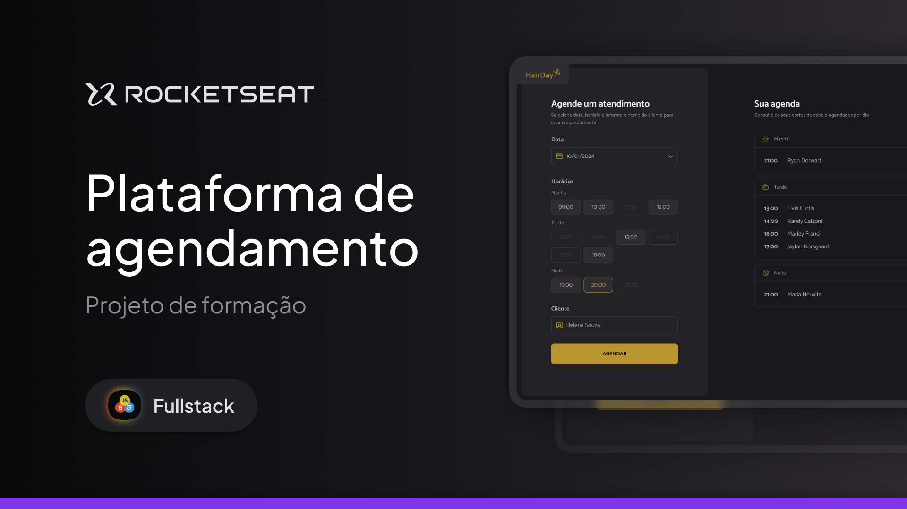
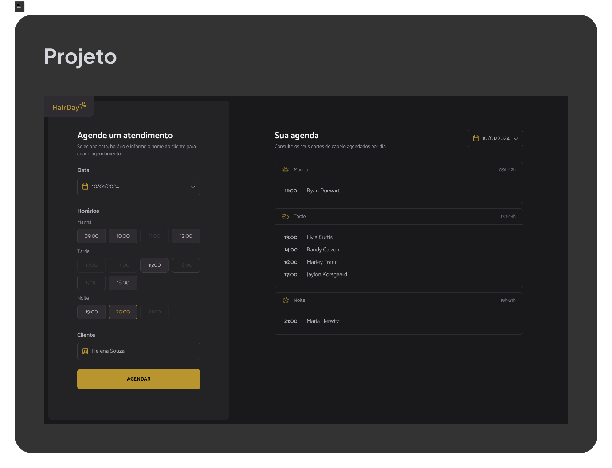

  

  <a href="#-projeto">Projeto</a>&nbsp;&nbsp;&nbsp;|&nbsp;&nbsp;&nbsp;
  <a href="#-tecnologias">Tecnologias</a>&nbsp;&nbsp;&nbsp;|&nbsp;&nbsp;&nbsp;
  <a href="#-layout">Layout</a>&nbsp;&nbsp;&nbsp;|&nbsp;&nbsp;&nbsp;
  <a href="#-licença">Licença</a>

  
  
  
  

---

  

## 💻 Projeto

A **Plataforma de Agendamento HairDay** é uma aplicação web voltada para o **gerenciamento de horários de corte de cabelo em barbearias**, permitindo criar, visualizar e cancelar agendamentos de forma simples, rápida e organizada. 
O projeto foi desenvolvido com foco em **arquitetura modular**, **boas práticas de JavaScript**, separação de responsabilidades e integração com uma **API simulada** utilizando `json-server`. 
É totalmente **responsivo** e funcional nas versões **Desktop** e **Mobile**.

### Funcionalidades principais:

- Criação de agendamentos com nome do cliente, data e horário.
- Listagem de agendamentos filtrados por dia.
- Cancelamento de agendamentos em tempo real.
- Bloqueio automático de horários já ocupados.
- Validação de datas e horários passados.
- Atualização dinâmica da interface sem recarregar a página.
- Arquitetura em camadas (`services`, `modules` e `utils`)

---

## 🚀 Tecnologias

Desenvolvido com:

- **HTML5**
- **CSS3**
- **JavaScript (ES Modules)**
- **Day.js**
- **Webpack**
- **Babel**
- **json-server**

---

## 🔖 Layout

Visualize o layout do projeto:

  

- Horários organizados por **Manhã**, **Tarde** e **Noite**. 
- Destaque visual para horários disponíveis e indisponíveis. 
- Lista de agendamentos do dia. 
- Ícone de cancelamento com confirmação do usuário.

---

## 📝 Como Abrir o Projeto

1. Clone ou baixe o repositório.
2. No terminal, instale as dependências do projeto: `npm install`.
3. Inicie a API simulada (json-server): `npm run server`.
   - A API ficará disponível em: http://localhost:3333.
4. Inicie o ambiente de desenvolvimento: `npm run dev`.
   - A aplicação será aberta em: http://localhost:3000.

## 📝 Como Usar o Projeto

1. Selecione uma data.
2. Escolha um horário disponível.
3. Informe o nome do cliente.
4. Confirme o agendamento.
5. Para cancelar, clique no ícone “X” na linha do agendamento desejado.

---

## 📚 Aprendizados Aplicados

- Arquitetura modular em JavaScript.
- Separação de responsabilidades (UI, Services e Lógica).
- Consumo de API REST com `fetch`.
- Manipulação de datas com Day.js.
- Controle de estado baseado em backend.
- Uso do `json-server` como API simulada.
- Configuração de ambiente com Webpack.
- Organização de código para escalabilidade.

---

## 👨‍💻 Autor

Desenvolvido por **Rocketseat** .
Adaptado e implementado por **William Milanez** .
📍 Formação de Full-Stack – _Plataforma de Agendamento_.

---

## 📄 Licença

Este projeto está sob a licença **MIT**. 
Este projeto é de uso educacional e livre para fins de estudo e prática pessoal.

---
